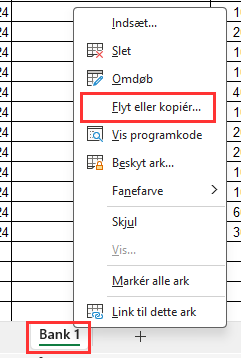
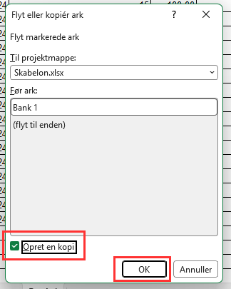

# Partshøring vedrørende potentielt uoplyst indtægt

## Til brugere

Denne robot kan bruges lokalt til at udfylde første del af formularen
"Partshøring vedrørende potentiel uoplyst indtægt".

Processen ser således ud:

1. En lokal Excel-fil med bankdata vælges.
2. Robotten læser filen og spørger brugeren om oplysninger er læst korrekt.
3. Formularen åbnes automatisk.
4. Brugeren logger ind med sit medarbejderlogin.
5. Robotten udfylder data fra Excel-filen.
6. Brugeren udfylder CPR-nummer og indsender formularen.
7. Brugeren lukker browseren.

### Excel-skabelon

Robotten forventer et helt bestemt format på den Excel-fil, der vælges.

Du kan herunder downloade en skabelon i det rette format.

Hent skabelonen her: [Skabelon.xlsx](https://github.com/itk-dev-rpa/attended-partshoering-uoplyst-indtaegt/raw/main/Skabelon.xlsx)

Bemærkninger:

- Udfyld bankens navn og registeringsnummer i felterne A2 og C2 (med rød skrift).
- Udfyld transaktioner i tabbellen fra række 4 og ned.
- Rækker der ikke har en dato i kolonne A bliver sprunget over af robotten.
- Kolonne D og E læses **ikke** af robotten.

#### Tilføj flere banker

Data om hver bank skal være på hver sin fane i Excel-arket. For at tilføje flere banker,
kan du kopiere den første fane ved at højreklikke på fanen og trykke 'Flyt eller kopier...'
og vælge 'Opret en kopi'.

## For developers

This robot is made to be run from ITK Attended RPA.

When run the `main.py` file is run which will install uv and initialize a virtual environment to run the robot in.
Dependencies are defined in the `uv.lock` file.

The actual process of the robot is in `process.py`.
